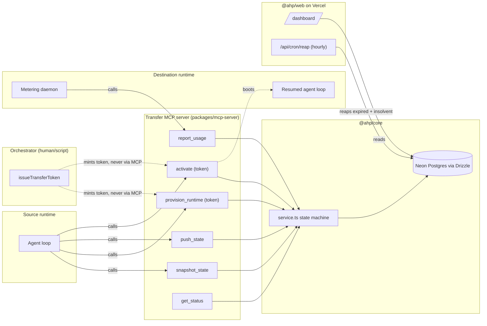

# Handoff Protocol

**Durable agent sessions that outlive their host.**

A protocol and reference implementation for serializing a running agent's
state, transferring it to a provisioned sandbox on a different machine, and
metering what it costs to keep running there — built as an MCP server over
a Postgres-backed state machine.

**Live:** [agent-handoff-protocol.vercel.app](https://agent-handoff-protocol.vercel.app) · [/dashboard](https://agent-handoff-protocol.vercel.app/dashboard) shows a real transfer, end to end, on a live Neon database.

<p>
  
  
  
</p>

---

## What this is

Long-running agent loops outgrow the machine they started on. This repo is
the boring infrastructure for handling that gracefully:

1. **`snapshot_state`** captures a session's system prompt, message history,
   tool state, and MCP config (credentials as vault references, never raw
   secrets) into a Postgres row, along with a checksum of the snapshot.
2. **`provision_runtime`** sizes a destination sandbox and opens a fixed
   compute budget. Requires a transfer-authorization token.
3. **`push_state`** uploads the snapshot to the destination, optionally
   verified against the checksum from step 1.
4. **`activate`** boots the destination from the snapshot — the one
   irreversible step in the whole protocol. Also requires a token.
5. **`report_usage`** lets the destination's own metering daemon report
   spend against its budget, flipping the transfer to `insolvent` once it's
   exhausted. An hourly cron job auto-terminates any transfer left
   insolvent past its grace period.
6. **`get_status`** reads back the full transfer, budget, and ordered event
   log — this is what the dashboard renders.

No tool in this surface resembles "does the agent want to transfer." That
decision belongs to whoever calls `provision_runtime` / `activate` — a
human, a script, a scheduler — and per the auth model below, only that
orchestrator can ever produce a valid token for those two calls. The full
reasoning behind the boundary is in
[`docs/DESIGN.md §5`](docs/DESIGN.md#5-where-mechanism-ends-and-narrative-begins).

The landing page carries a short piece of narrative flavor text alongside
the real, live event data — clearly labeled as fiction, not telemetry. The
mechanism is real; the story is a showcase layer on top of it.

## Architecture



## Repo layout

```
packages/
  core/         Drizzle schema + framework-agnostic service layer (the state machine, auth, tests)
  mcp-server/   MCP stdio server exposing the six tools above, wraps @ahp/core
  web/          Next.js app: landing page + /dashboard (live) + /docs + /disclaimers + cron route
scripts/
  demo.ts       Runs one full lifecycle end-to-end against a real Neon DB
docs/
  DESIGN.md     Full technical spec, including what's simplified for this showcase
  ROADMAP.md    Phased plan for what's built vs. what's next, review-approved
  TEAM.md       Named draft-only personas — see for the "no auto-publishing" hard rule
content/
  drafts/       Where personas draft content; nothing here is published automatically
.github/workflows/ci.yml   Build + typecheck + test on every push/PR to main
```

Three packages, one schema — the MCP server, the demo script, and the
dashboard's read queries all call the same `@ahp/core` functions rather than
reimplementing the state machine three times.

## Quick start

```bash
git clone https://github.com/zordhalo/agent-handoff-protocol
cd agent-handoff-protocol
pnpm install
pnpm --filter @ahp/core build   # @ahp/core ships compiled (dist/ is gitignored); demo.ts and the web app both import it

# Pull DATABASE_URL, TRANSFER_TOKEN_SECRET, CRON_SECRET from the Vercel project
vercel link
vercel env pull .env.local

pnpm db:migrate      # apply the schema to your Neon DB
pnpm demo            # run one full staged→provisioned→pushed→active→insolvent→terminated cycle
pnpm --filter @ahp/web dev   # open http://localhost:3000/dashboard to see it
```

## Auth setup

`provision_runtime` and `activate` both require a transfer-authorization
token (docs/ROADMAP.md Phase 1 item 4). Tokens are HMAC-signed, short-lived,
and single-use, and are minted by `issueTransferToken` from `@ahp/core` —
**never** by an MCP tool, so the source loop (the agent) has no path to
mint one itself. `scripts/demo.ts` plays the orchestrator role and mints
its own tokens; a real deployment would do this from whatever process is
actually driving the handoff (a script, a human-triggered API route).

```bash
# TRANSFER_TOKEN_SECRET gates provision_runtime/activate.
# CRON_SECRET gates the /api/cron/reap route (Vercel attaches it automatically
# to its own scheduled invocations once it's set as a project env var).
node -e "console.log(require('crypto').randomBytes(32).toString('base64url'))"
```

Set the output as `TRANSFER_TOKEN_SECRET` (and a separately generated value
as `CRON_SECRET`) in your Vercel project's environment variables, then
`vercel env pull .env.local` again to pick them up locally.

### Running the MCP server against a real agent client

```bash
pnpm --filter @ahp/mcp-server build
```

Point your MCP-capable client at
`packages/mcp-server/dist/index.js` (stdio transport) with `DATABASE_URL` set
in its environment.

## Database setup

This repo assumes Neon Postgres, provisioned through Vercel's integration
marketplace (Project → Storage → Neon), which sets `DATABASE_URL` for you.
Any Postgres connection string works — `@ahp/core` only needs it in the
environment.

```bash
pnpm db:generate   # regenerate drizzle/ migrations after a schema change
pnpm db:migrate     # apply them
```

## What's real vs. simplified

This is a working reference implementation, not a hardened production
system — the "destination runtime" in the demo is a script writing to the
same database the dashboard reads, not an isolated sandbox, and `credRef`
is still a free-text string rather than a real vault lookup. Auth-gating
and the insolvency-termination lifecycle, previously listed as gaps, are
now real (docs/ROADMAP.md Phase 1). The current, honest breakdown of
what's real vs. simulated is [`docs/DESIGN.md §7`](docs/DESIGN.md#7-whats-real-vs-simplified-in-this-showcase),
and what's planned next is [`docs/ROADMAP.md`](docs/ROADMAP.md).

## Stack

- [Neon](https://neon.tech) Postgres, provisioned via the Vercel marketplace
- [Drizzle ORM](https://orm.drizzle.team) with the `@neondatabase/serverless` HTTP driver
- [`@modelcontextprotocol/sdk`](https://modelcontextprotocol.io) for the tool server
- [Next.js](https://nextjs.org) App Router, deployed on [Vercel](https://vercel.com), incl. a Vercel Cron route
- [Vitest](https://vitest.dev) for integration tests against a live Neon database
- pnpm workspaces monorepo, GitHub Actions CI

## License

MIT — see [LICENSE](LICENSE).
